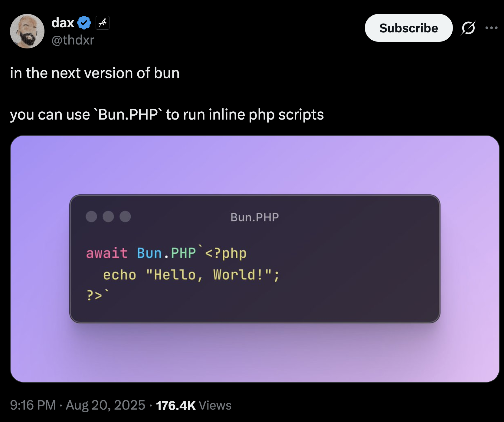

<p align="center">
  
</p>

# 🐘 bun-php

Now you can finally run PHP files in Bun! Import a `.php` file and bun-php turns its functions into async,
typed JavaScript functions running under PHP 8.5.

```php
<?php
// hello.php
function greet(string $name): string
{
    return "Hello, $name!";
}
```

```ts
import { greet } from "./hello.php";

console.log(await greet("world")); // "Hello, world!"
```

No PHP binary is required — PHP 8.5 runs inside WebAssembly.

## Install

```bash
bun add bun-php
```

Then register the plugin in `bunfig.toml`:

```toml
preload = ["bun-php/register"]

# The top-level `preload` does not apply to `bun test`, so repeat it here
# if your tests import .php files.
[test]
preload = ["bun-php/register"]
```

## Can I do the meme thing?

Yes!

```ts
import { BunPHP } from "bun-php";

await BunPHP`<?php echo "Hello, World!"; ?>`;

> Hello, World!
```

The original tweet:



## What gets exported

Every top-level `function` becomes an async JavaScript function, and every top-level constant with a
literal value becomes a plain exported value.

```php
<?php
const GREETING = 'Hello';

function greet(string $name, string $greeting = GREETING): string
{
    return "$greeting, $name!";
}

function addAll(int ...$numbers): int
{
    return array_sum($numbers);
}
```

```ts
import phpModule, { greet, addAll, GREETING } from "./hello.php";

await greet("world"); // "Hello, world!"
await greet("Bun", "Hey"); // "Hey, Bun!"
await addAll(1, 2, 3); // 6
GREETING; // "Hello" — a plain value, no await, no PHP boot
```

Class methods, closures and arrow functions are ignored. A constant that needs PHP to evaluate it (say
`const C = 'a' . 'b';`) is skipped and noted in a comment in the generated module.

PHP function names that are JavaScript reserved words still work — import them with an alias:

```ts
import { delete as deleteFile } from "./files.php";
```

## Inline PHP

For a snippet that doesn't warrant a PHP file, tag a template with `BunPHP`. It prints as PHP runs and
resolves to a top-level `return` (or `null`); `BunPHP.capture` prints nothing and resolves to the output
instead:

```ts
import { BunPHP } from "bun-php";

await BunPHP`<?php echo "Hello world";`; // prints "Hello world", resolves to null
await BunPHP`<?php return 40 + 2;`; // 42
await BunPHP.capture`<?php echo "Hello world";`; // "Hello world"
await BunPHP.capture`<?php return 40 + 2;`; // 42 — a return still wins
await BunPHP.capture`<?php echo "out"; return null;`; // "out" — see below
```

`capture` falls back to the output when the snippet returns `null`, and PHP cannot tell an explicit
`return null;` from a snippet that returned nothing at all. Every other value wins, `false` and `""`
included.

Both tags are optional: a tag-less snippet is code, `<?= ... ?>` works, and markup around the tags is
emitted just as it would be from a PHP file:

```ts
await BunPHP`return 1 + 1;`; // 2
await BunPHP.capture`<?= 6 * 7 ?>`; // "42"
await BunPHP.capture`<p>a</p><?php echo "b";`; // "<p>a</p>b"
```

Interpolated values are converted to PHP **expressions**, so they go where an expression is valid, not
inside a string literal:

```ts
const name = "Bun";
await BunPHP`<?php return "Hello " . ${name} . "!";`; // "Hello Bun!"
await BunPHP`<?php return array_sum(${[1, 2, 3, 4]});`; // 10
await BunPHP`<?php return "Hello ${name}";`; // literal text, not the value
```

The snippet is read from the template's **raw** segments, so escapes are PHP's rather than JavaScript's —
`preg_match('/\d+/', ...)` keeps its `\d`, and `\DateTime` keeps its backslash. Write real newlines rather
than `\n` when you want one:

```ts
await BunPHP`return preg_match("/\d+/", "abc123");`; // 1
await BunPHP`return 'a\tb';`; // "a\tb" - single quotes, so PHP keeps the backslash
await BunPHP`return "a\tb";`; // "a<tab>b" - PHP expands it, not JavaScript
```

Inline PHP is a plain runtime API: it needs no plugin registration and no `preload` entry. Both tags share
one interpreter, each snippet runs as its own PHP request, and `BunPHP.dispose()` shuts it down.

## Types

The plugin writes a sidecar `hello.php.d.ts` next to each `.php` file, derived from the PHP type
declarations, so `import ... from "./hello.php"` gets autocomplete and type errors:

```ts
export declare function greet(name: string, greeting?: string): Promise<string>;
export declare function addAll(...numbers: number[]): Promise<number>;
export declare const GREETING: "Hello";
```

Commit these generated files or add `*.php.d.ts` to `.gitignore` — either works.

| PHP              | TypeScript                                  |
| ---------------- | ------------------------------------------- |
| `int`, `float`   | `number`                                    |
| `string`         | `string`                                    |
| `bool`           | `boolean`                                   |
| `array`          | `PhpValue[] \| { [key: string]: PhpValue }` |
| `void`           | `void`                                      |
| `mixed`, no hint | `any`                                       |
| `?T`, `T\|null`  | `T \| null`                                 |
| `A\|B`           | `A \| B`                                    |
| a class name     | `Record<string, unknown>`                   |

When a type hint is missing, `@param` / `@return` docblock tags are used instead. A bare `array` hint also
defers to the docblock, so `@param float[] $values` on `function stats(array $values)` yields
`values: number[]`. Docblock summaries become JSDoc comments.

Not generating sidecars? Reference the fallback declaration, which types every `.php` import as `any`:

```ts
/// <reference types="bun-php/types" />
```

## Multi-file projects and Composer

bun-php mounts the project directory into the WebAssembly filesystem, so `require` of a sibling file,
`__DIR__`, and Composer's autoloader work as expected:

```php
<?php
// app/report.php
use League\CommonMark\CommonMarkConverter;

require_once __DIR__ . '/helpers.php';

function report(string $markdown): string
{
    return (new CommonMarkConverter())->convert($markdown) . footer();
}
```

```ts
import { report } from "./app/report.php";
await report("# Title");
```

The project root is found by walking up from the `.php` file looking for `vendor/autoload.php` or
`composer.json` (the file's own directory is the fallback). When a `vendor/autoload.php` is found it is
required before every call.

The mount is a live view of the host filesystem — files written after the interpreter booted are visible,
and PHP can write back to disk. See [`demos/`](demos/) for real examples.

## Module API

The default export exposes methods for controlling the interpreter directly:

```ts
import php from "./hello.php";

await php.$ready(); // boot without calling anything
await php.$eval("return PHP_VERSION;");
await php.$reset(); // discard all PHP state; the next call boots afresh
await php.$dispose(); // shut the interpreter down
const raw = await php.$php(); // the underlying php-wasm PHP instance
php.$meta; // what the parser found in this file
await php.call("greet", ["x"]); // call by name
```

## Driving PHP directly

Importing a `.php` file is for calling library code. Driving a PHP **tool** — a phar, a linter, a
formatter — needs an argument list, a directory only known at call time, and a fitting `php.ini`. That's
what `createInterpreter` is for. It involves no `.php` import, no codegen and no `preload`:

```ts
import { createInterpreter } from "bun-php";

const php = createInterpreter({
  phpVersion: "8.3",
  spawn: "refuse",
  ini: { memory_limit: "1024M" },
});

await php.mount("/tmp/some-project", "/project");
const { stdout, exitCode } = await php.cli([
  "php",
  "/tools/phpcs.phar",
  "--report=json",
  "/project",
]);
```

| Option       | Default | Meaning                                                                                                             |
| ------------ | ------- | ------------------------------------------------------------------------------------------------------------------- |
| `phpVersion` | `"8.5"` | Which build to boot. Any other version must be installed by you — see below.                                        |
| `loader`     | –       | Supply the php-wasm build yourself. Takes precedence over `phpVersion`.                                             |
| `ini`        | –       | `php.ini` entries, applied before the first call.                                                                   |
| `spawn`      | –       | `"refuse"`, or your own handler. See the warning below.                                                             |
| `mounts`     | –       | `{ host, at }` directories to mount up front.                                                                       |
| `timeoutMs`  | –       | Deadline for `cli()`. In-process it bounds waiting, not the work (see Limitations); under isolation it's a SIGKILL. |
| `isolation`  | –       | `"process"` runs each `cli()` in a child process that exits afterwards.                                             |

Beyond `cli()`, an interpreter offers `mount()`, `ini()`, `writeFile()`, `mkdir()`, `php()` (the raw
php-wasm instance) and `dispose()`. Every `cli()` runs in a fresh PHP instance, and what you staged with
`mount`/`writeFile`/`mkdir`/`ini` is re-applied to each one.

### Process isolation

The in-process interpreter is fine for a handful of calls. For running a tool across thousands of inputs,
`isolation: "process"` runs every `cli()` in a child process that exits when the call ends:

```ts
const php = createInterpreter({
  isolation: "process",
  phpVersion: "8.3",
  spawn: "refuse",
  ini: { memory_limit: "1024M" },
  timeoutMs: 600_000, // a real deadline: the child is SIGKILLed
});

await php.mount(exportDir, "/plugin");
await php.writeFile("/files.txt", list);
const { stdout, exitCode } = await php.cli(["php", "/tools/phpcs.phar", ...]);
```

It fixes three things the in-process interpreter can't:

- **Memory returns to baseline.** The wasm heap retains hundreds of MB across boot/dispose cycles
  in-process; an exiting child hands it back to the OS.
- **`timeoutMs` actually cancels.** In-process a timeout only abandons the request; here it SIGKILLs the
  child and the work stops.
- **Calls run in parallel.** Two concurrent one-second calls take 1.04× the time of one, versus 1.96×
  in-process.

Errors keep their type across the boundary: a `PhpBuildNotInstalledError` from the child is still one in the
parent, with its `packageName` and the cause's message intact.

Each child boots its own wasm and replays your `mount`/`writeFile`/`mkdir`/`ini` calls before the command,
so it sees the same files and config an in-process interpreter would. That setup has to survive JSON:
`loader` and a function-valued `spawn` are rejected at construction (`spawn: "refuse"` is fine), and `php()`
has no in-process instance to return. Each call also pays a child spawn plus a fresh wasm boot (a few
hundred milliseconds) — noise for a tool run, wrong for a hot loop of small calls.

### Choosing a PHP version

`phpVersion` defaults to `8.5`, the only build bun-php depends on. Every other version is an **optional peer
dependency**, so you install the one you want:

```bash
bun add @php-wasm/node-8-3
```

Each build is tens of megabytes of WebAssembly, which is why they aren't all bundled. Asking for one you
haven't installed throws `PhpBuildNotInstalledError`, naming the package to add; a build that is installed
but won't load throws `PhpBuildLoadError` instead, with the real failure as its `cause`. Each build picks
the JSPI or asyncify variant itself; use `loader` to pin one:

```ts
createInterpreter({
  loader: () => import("@php-wasm/node-8-3/asyncify/php_8_3.js"),
});
```

### Spawning

PHP's `exec`, `shell_exec` and `popen` reach the host through a spawn handler. There is no default, and
**leaving one uninstalled hangs the process**: a tool that probes for a terminal with `shell_exec('tty')` —
PHP_CodeSniffer does — waits forever for an answer that never comes.

`spawn: "refuse"` answers every spawn with an immediate non-zero exit, which is what analysis tools want. A
real handler that shells out gives any PHP you run full host execution, so install one deliberately.

## Plugin options

```ts
import { phpPlugin } from "bun-php";

Bun.build({
  entrypoints: ["./src/index.ts"],
  outdir: "./dist",
  target: "bun",
  plugins: [phpPlugin({ stdout: "capture" })],
});
```

| Option     | Default     | Meaning                                                                                                   |
| ---------- | ----------- | --------------------------------------------------------------------------------------------------------- |
| `dts`      | `"auto"`    | Write sidecar types. `"auto"` writes unless producing a bundle.                                           |
| `stdout`   | `"inherit"` | Where PHP's `echo` output goes: `"inherit"`, `"capture"` (drain with `php.$output()`), or `"ignore"`.     |
| `filter`   | `/\.php$/`  | Which files to handle.                                                                                    |
| `mount`    | `true`      | Mount the project directory so sibling `require`s and Composer resolve. `false` drops the autoloader too. |
| `autoload` | auto        | Path to a file to require before each call. Auto-detects `vendor/autoload.php`; `false` disables.         |
| `runtime`  | -           | Interpreter options for every module loaded: `phpVersion`, `ini`, `mounts`, `spawn`, `timeoutMs`.         |

As in-process everywhere, `runtime.timeoutMs` bounds how long you **wait**: the call rejects with
`PhpTimeoutError` while the PHP keeps running, and later calls queue behind it. Only `isolation: "process"`
can actually cancel.

`runtime` reaches the module as generated source, so it takes only what survives JSON: `loader`, a
`spawn` handler function and `isolation` are rejected up front. Reach for `createInterpreter` when you
need those.

```ts
phpPlugin({ runtime: { phpVersion: "8.3", ini: { memory_limit: "256M" } } });
```

The `bun build` **CLI** can't use plugins at all — use the `Bun.build()` JS API, or
`[serve.static] plugins = ["bun-php"]` for the dev server.

## How it works

1. An `onLoad` hook intercepts `.php` imports.
2. [php-parser](https://github.com/glayzzle/php-parser) reads the file and collects its top-level functions
   and constants.
3. The plugin emits a JS module whose exports proxy into PHP.
4. On the first call, [php-wasm](https://github.com/WordPress/wordpress-playground) boots a PHP 8.5
   interpreter and mounts the project directory into its virtual filesystem; later calls reuse it.
5. Arguments and return values cross as JSON. PHP's own output is streamed separately so it can never
   corrupt the result.

## Limitations

**Each call is an isolated PHP request.** php-wasm resets request-scoped state between runs, so `static`
variables, globals and superglobals don't carry over. The interpreter is reused (that's what makes calls
fast), but PHP userland state is not.

```php
function tick(): int { static $n = 0; return ++$n; }
```

```ts
await tick(); // 1
await tick(); // 1, not 2
```

Use `$eval` or module-level PHP for state within a single call, or keep state on the JavaScript side.

**A running PHP request can't be interrupted, and in-process calls don't run in parallel.** The wasm holds
the thread, `max_execution_time` is ignored, and `PHP.exit()` mid-call returns without stopping anything.
In-process `timeoutMs` rejects your promise but the PHP keeps running, and two concurrent one-second calls
take two seconds. `isolation: "process"` is the answer to both, and it's crash-safe too: an uncatchable
wasm abort takes only its own child.

**Other things to know:**

- **ESM only.** `.php` modules can't be loaded with `require()`.
- **Values cross by JSON.** Integers beyond `Number.MAX_SAFE_INTEGER` lose precision; resources and closures
  can't be returned; objects arrive as their public properties. `NaN` and `Infinity` cross as whole
  arguments only — nested in an array or object they throw rather than silently arriving as `null`.
  Nested `undefined` follows JSON instead: `null` in an array, and a dropped key in an object. Only a
  whole argument that is `undefined` is an error. PHP list arrays become JS arrays,
  associative arrays become objects, and JS objects arrive in PHP as associative arrays (not `stdClass`).
- **By-reference parameters (`&$x`) don't write back.** Arguments pass by value; the generated types carry a
  JSDoc warning.
- **Only the project directory is mounted.** A `require` pointing outside the detected root won't resolve.
  Set `mount: false` to opt out, leaving only the imported file's own source — the detected
  `vendor/autoload.php` goes with it, since nothing outside the mount is reachable.
- **No networking and no Xdebug.** Available extensions are whatever the php-wasm build ships: `mbstring`,
  `openssl`, `hash`, `bcmath`, `dom`, `tokenizer`, `gd`, `zip`, `curl`, `sqlite3` and friends. **`intl` is
  absent**, so packages requiring `ext-intl` won't load.
- **`function readonly()` doesn't parse.** PHP 8.5 allows `readonly` as a function name, but php-parser
  rejects it, so a file declaring one fails to import.
- **Only what you mount exists** inside the virtual filesystem. Don't reach for `open_basedir` or
  `disable_functions` as a substitute; their behaviour under php-wasm varies by build.
- **Short open tags are on**, because the bundled build ships PHP's built-in default and no `php.ini`.
  So `<? ... ?>` runs as code — and `<?xml version="1.0"?>` is a parse error, exactly as it is in raw
  PHP with that setting. Open with `<?php`.
- **Constants are evaluated at build time**, so a shape whose value depends on the PHP version isn't
  exported at all: an array key past 2^53, or an implicit key following a negative one (PHP 8.3
  changed where it resumes). Those land in the `// Not exported:` trailer instead of exporting a
  value that would be wrong on some supported build.

## Development

```bash
bun install
bun test
bun run example
```

## License

MIT
